# Stripe Payment Integration POC

A proof-of-concept payment processing application built to validate Stripe integration patterns for **AuctionSystem** — the main project currently in development. This POC demonstrates three distinct payment scenarios: one-time invoice checkout, recurring subscriptions, and merchant-driven installment plans.

## Purpose

AuctionSystem requires a payment processing module to collect payments from auction winners. Before integrating Stripe into the main codebase, this POC was built to:

- Validate three Stripe payment patterns: one-time payments, subscriptions, and installment plans
- Confirm that Stripe's hosted Checkout page handles card and debit inputs securely
- Test webhook event delivery and signature verification in a local development environment
- Establish the backend API pattern (Spring Boot + Stripe Java SDK) that will be adopted in AuctionSystem
- Verify Docker Compose deployment with a Spring Boot backend, React frontend (nginx), and PostgreSQL

## Tech Stack

| Component | Technology | Version |
|-----------|-----------|---------|
| Backend | Spring Boot | 3.4.1 |
| Language | Java | 17+ |
| Payment SDK | Stripe Java SDK | 28.2.0 |
| Frontend | React + Vite | React 19, Vite 8 |
| Styling | Tailwind CSS | 4.x |
| Database | PostgreSQL | 16 |
| Containerization | Docker Compose | v2 |
| Frontend Server | nginx | Alpine |

## Architecture

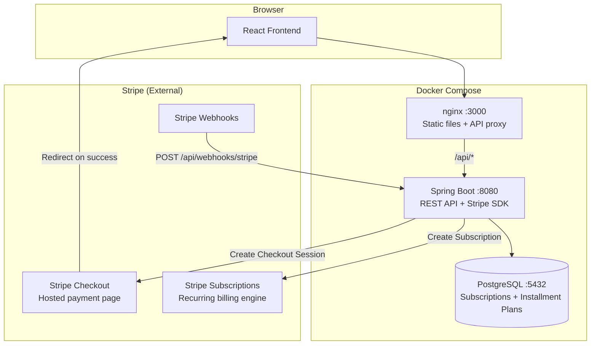

## Docker Compose Deployment

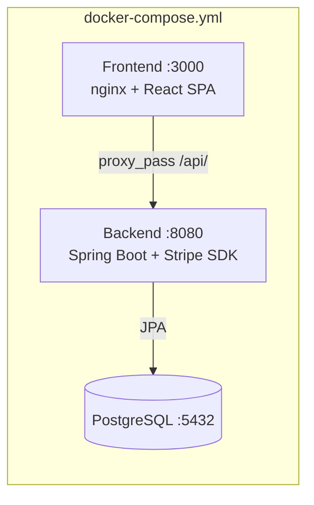

Three containers:
- **postgres** — Stores subscription records and installment plan state. Healthcheck ensures readiness before the backend starts.
- **backend** — Spring Boot application serving REST APIs and communicating with Stripe via the Java SDK.
- **frontend** — nginx serving the React production build and proxying `/api/*` requests to the backend.

---

## Use Case 1: One-Time Invoice Payment

A customer pays for services rendered via a one-time checkout. The merchant adds line items, the system calculates 13% GST, and the customer pays through Stripe's hosted checkout page.

### Sequence Diagram

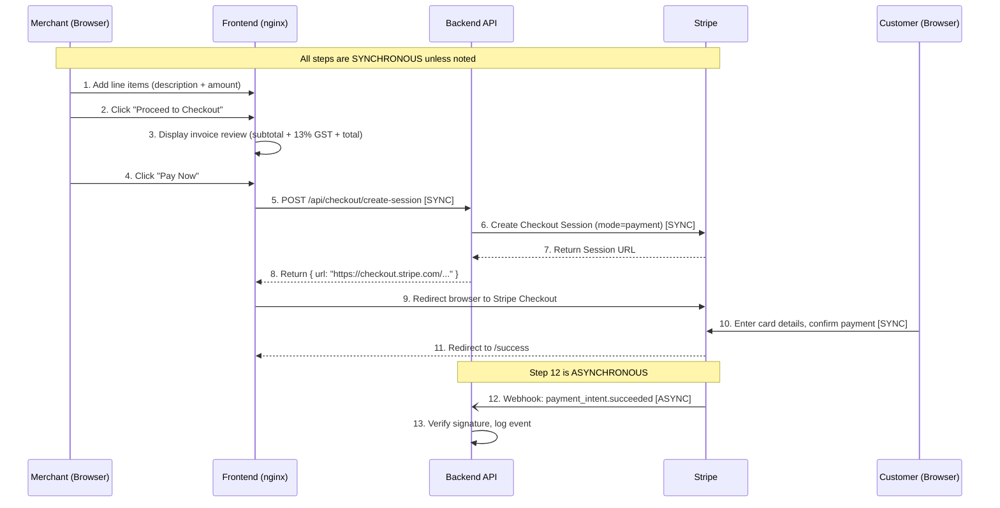

### Step-by-Step

| Step | Actor | Action | Sync/Async |
|------|-------|--------|------------|
| 1 | Merchant | Adds items with description and dollar amount on the Items page | Sync (UI) |
| 2 | Merchant | Clicks "Proceed to Checkout" to navigate to the review page | Sync (UI) |
| 3 | Frontend | Calculates and displays subtotal, 13% GST, and total in CAD | Sync (UI) |
| 4 | Merchant | Clicks "Pay Now" to initiate payment | Sync (UI) |
| 5 | Frontend → Backend | `POST /api/checkout/create-session` with line items, subtotal, GST, total | Sync (HTTP) |
| 6 | Backend → Stripe | Creates a Stripe Checkout Session in `payment` mode with line items + GST as separate line item | Sync (Stripe API) |
| 7-8 | Stripe → Backend → Frontend | Returns the hosted checkout URL | Sync (HTTP) |
| 9 | Frontend | Redirects the browser to Stripe's hosted checkout page | Sync (redirect) |
| 10 | Customer | Enters card/debit details on Stripe's page and confirms payment | Sync (Stripe hosted) |
| 11 | Stripe → Frontend | After successful payment, Stripe redirects to `/success` with session ID | Sync (redirect) |
| 12 | Stripe → Backend | Stripe sends a `payment_intent.succeeded` webhook event | **Async** (webhook) |
| 13 | Backend | Verifies the webhook signature and logs the event | Sync (internal) |

---

## Use Case 2: Recurring Subscription

A customer subscribes to a cleaning service plan (Weekly $100, Bi-Weekly $180, or Monthly $350). The customer can check their subscription status and cancel at any time.

### Sequence Diagram — Subscribe

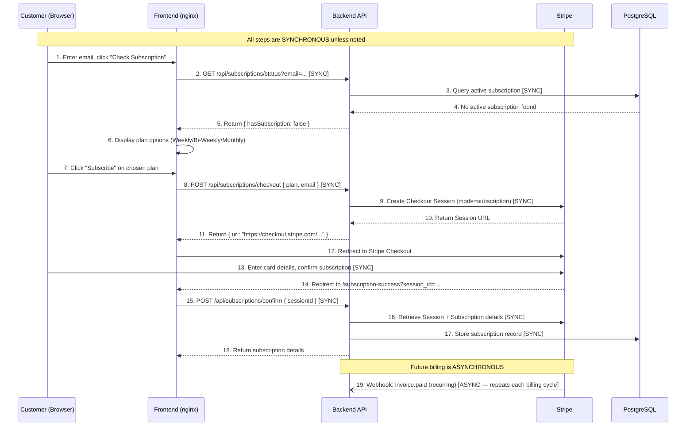

### Step-by-Step — Subscribe

| Step | Actor | Action | Sync/Async |
|------|-------|--------|------------|
| 1 | Customer | Enters email and clicks "Check Subscription" | Sync (UI) |
| 2-5 | Frontend → Backend → DB | Checks if customer has an active subscription | Sync (HTTP + DB) |
| 6 | Frontend | Displays three plan cards: Weekly $100, Bi-Weekly $180, Monthly $350 | Sync (UI) |
| 7 | Customer | Clicks "Subscribe" on their chosen plan | Sync (UI) |
| 8 | Frontend → Backend | `POST /api/subscriptions/checkout` with plan type and email | Sync (HTTP) |
| 9 | Backend → Stripe | Creates a Checkout Session in `subscription` mode. Backend creates a Stripe Product + Price for the plan if not already cached. | Sync (Stripe API) |
| 10-11 | Stripe → Backend → Frontend | Returns the hosted checkout URL | Sync (HTTP) |
| 12-13 | Customer | Redirected to Stripe Checkout, enters card details, confirms | Sync (Stripe hosted) |
| 14 | Stripe → Frontend | Redirects to `/subscription-success` with session ID | Sync (redirect) |
| 15-18 | Frontend → Backend → Stripe → DB | Backend retrieves subscription details from Stripe, stores in PostgreSQL | Sync (HTTP + Stripe API + DB) |
| 19 | Stripe → Backend | On each billing cycle, Stripe charges the card and sends `invoice.paid` webhook | **Async** (recurring) |

### Sequence Diagram — Cancel

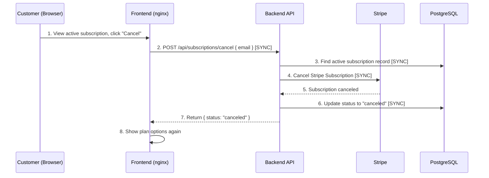

### Step-by-Step — Cancel

| Step | Actor | Action | Sync/Async |
|------|-------|--------|------------|
| 1 | Customer | Views their active subscription and clicks "Cancel Subscription" | Sync (UI) |
| 2 | Frontend → Backend | `POST /api/subscriptions/cancel` with customer email | Sync (HTTP) |
| 3 | Backend → DB | Finds the active subscription record | Sync (DB) |
| 4-5 | Backend → Stripe | Cancels the subscription in Stripe immediately | Sync (Stripe API) |
| 6 | Backend → DB | Updates local record status to "canceled" | Sync (DB) |
| 7-8 | Backend → Frontend | Returns canceled status, UI shows plan options again | Sync (HTTP) |

---

## Use Case 3: Merchant-Driven Installment Plan (Two-Phase)

The merchant creates a custom installment plan for a customer with a custom first payment and equal remaining installments. The customer receives a payment link, pays the first installment, and Stripe automatically charges the remaining installments on a recurring schedule.

### Sequence Diagram — Phase 1: Setup + First Payment

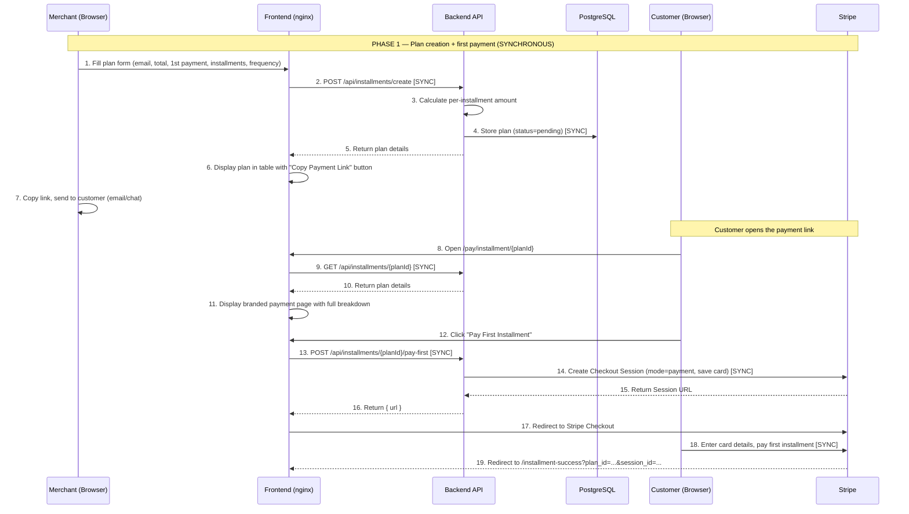

### Sequence Diagram — Phase 2: Subscription for Remaining Installments

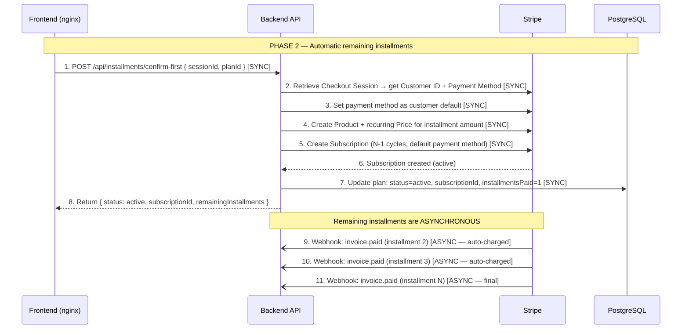

### Step-by-Step — Full Flow

| Step | Phase | Actor | Action | Sync/Async |
|------|-------|-------|--------|------------|
| 1 | Setup | Merchant | Fills in: customer email, description, total amount, first payment, number of installments, frequency | Sync (UI) |
| 2 | Setup | Frontend → Backend | `POST /api/installments/create` with plan details | Sync (HTTP) |
| 3 | Setup | Backend | Calculates: remaining = total - first; per installment = remaining / (N-1); last installment absorbs rounding | Sync (internal) |
| 4 | Setup | Backend → DB | Stores plan with status "pending" | Sync (DB) |
| 5-6 | Setup | Backend → Frontend | Returns plan details; table shows "Copy Payment Link" button | Sync (HTTP) |
| 7 | Setup | Merchant | Copies the payment link (`/pay/installment/{planId}`) and sends it to the customer | Manual (out-of-band) |
| 8-11 | Phase 1 | Customer | Opens the link, sees branded page: "You received a payment link from Shakhawat's Business" with full installment breakdown | Sync (HTTP + UI) |
| 12-16 | Phase 1 | Customer → Backend → Stripe | Clicks "Pay First Installment"; backend creates a Checkout Session with `setup_future_usage=off_session` to save the card | Sync (HTTP + Stripe API) |
| 17-18 | Phase 1 | Customer | Redirected to Stripe Checkout, enters card, pays first installment | Sync (Stripe hosted) |
| 19 | Phase 1 | Stripe → Frontend | Redirects to success page with session ID and plan ID | Sync (redirect) |
| 1-3 (Phase 2) | Phase 2 | Frontend → Backend → Stripe | Retrieves the Checkout Session, extracts Customer ID and Payment Method, sets it as the customer's default | Sync (HTTP + Stripe API) |
| 4-5 (Phase 2) | Phase 2 | Backend → Stripe | Creates a recurring Price and Subscription for the remaining installments using the saved card | Sync (Stripe API) |
| 6-8 (Phase 2) | Phase 2 | Stripe → Backend → DB → Frontend | Subscription confirmed, plan updated to "active", success shown to customer | Sync (HTTP + DB) |
| 9-11 (Phase 2) | Ongoing | Stripe → Backend | Stripe automatically charges the saved card on each billing cycle and sends `invoice.paid` webhooks | **Async** (recurring, automatic) |

### Example Calculation

For a $1,200 plan with $500 first payment and 4 monthly installments:

| Installment | Amount | When | How |
|-------------|--------|------|-----|
| 1st (custom) | $500.00 | Immediately | Stripe Checkout (one-time payment) |
| 2nd | $233.33 | Month 2 | Stripe Subscription (auto-charged) |
| 3rd | $233.33 | Month 3 | Stripe Subscription (auto-charged) |
| 4th | $233.34 | Month 4 | Stripe Subscription (auto-charged, absorbs rounding) |

---

## Webhook Flow (All Use Cases)

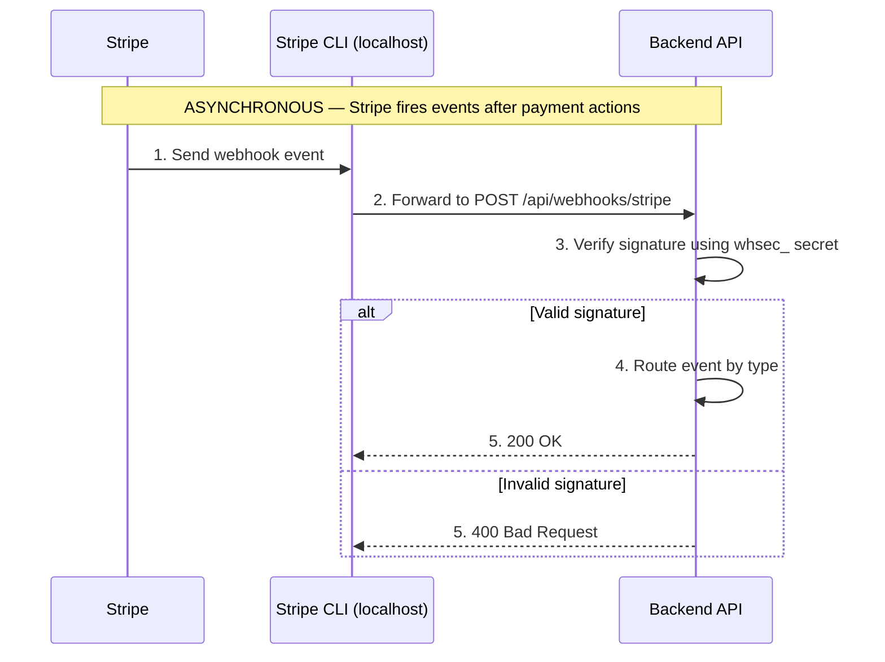

Webhook events are always **asynchronous** — Stripe fires them after a payment action completes, independently of the user's browser session. In local development, the Stripe CLI acts as a tunnel, forwarding events from Stripe's servers to `localhost:8080`.

---

## Prerequisites

Install the following on Windows before starting:

| Software | Version | Download |
|----------|---------|----------|
| Java JDK | 17+ | [Adoptium](https://adoptium.net/) |
| Node.js | 20+ | [nodejs.org](https://nodejs.org/) |
| npm | 10+ | Included with Node.js |
| Docker Desktop | 4.x+ | [docker.com](https://www.docker.com/products/docker-desktop/) |
| Git | 2.x+ | [git-scm.com](https://git-scm.com/) |

Verify installations in PowerShell:

```powershell
java -version          # Should show 17+
node -v                # Should show v20+
npm -v                 # Should show 10+
docker --version       # Should show Docker 24+
docker compose version # Should show v2+
```

If PowerShell blocks npm/node scripts:

```powershell
Set-ExecutionPolicy -Scope CurrentUser -ExecutionPolicy RemoteSigned
```

## Development Setup (Windows)

### 1. Clone the Repository

```powershell
git clone <repository-url>
cd StripeIntegration
```

### 2. Create a Stripe Account and Get API Keys

1. Go to [https://dashboard.stripe.com/register](https://dashboard.stripe.com/register) and create a free account
2. Ensure you're in **Test mode** (toggle in the top-right of the dashboard)
3. Go to **Developers > API keys**
4. Copy your **Secret key** (`sk_test_...`) — used by the backend
5. Copy your **Publishable key** (`pk_test_...`) — used by the frontend for Stripe.js initialization

### 3. Download the Stripe CLI

1. Download the latest Windows release from [https://github.com/stripe/stripe-cli/releases/latest](https://github.com/stripe/stripe-cli/releases/latest) (look for `stripe_x.x.x_windows_x86_64.zip`)
2. Extract the zip and place `stripe.exe` into a `stripe-bin/` folder at the project root:
   ```
   StripeIntegration/
   └── stripe-bin/
       └── stripe.exe
   ```
   This folder is git-ignored — each developer downloads their own copy.

### 4. Configure Webhooks for Local Development

Stripe cannot reach `localhost` directly. The Stripe CLI creates a tunnel to forward webhook events to your local backend.

Log in to Stripe CLI:

```powershell
.\stripe-bin\stripe.exe login
```

Start the webhook listener in a **separate terminal** (keep it running during development):

```powershell
.\stripe-bin\stripe.exe listen --forward-to http://localhost:8080/api/webhooks/stripe
```

Output:

```
> Ready! Your webhook signing secret is whsec_abc123def456...
```

Copy the `whsec_...` value for the next step.

To test webhook delivery:

```powershell
.\stripe-bin\stripe.exe trigger payment_intent.succeeded
```

### 5. Configure Environment Variables

```powershell
Copy-Item .env.example .env
```

Edit `.env` with your values:

```env
STRIPE_API_KEY=sk_test_your_secret_key_here
STRIPE_WEBHOOK_SECRET=whsec_your_cli_secret_here
VITE_STRIPE_PUBLISHABLE_KEY=pk_test_your_publishable_key_here
```

The `STRIPE_WEBHOOK_SECRET` must be the `whsec_` value from the `stripe listen` output (step 4), not from the Stripe Dashboard.

### 6. Build the Application

Backend:

```powershell
cd backend
.\gradlew.bat bootJar
cd ..
```

Frontend:

```powershell
cd frontend
npm install
npm run build
cd ..
```

### 7. Deploy with Docker Compose

```powershell
docker compose up --build -d
```

To force a clean rebuild:

```powershell
docker compose down
docker compose build --no-cache
docker compose up -d
```

To reset the database:

```powershell
docker compose down -v
docker compose up --build -d
```

### 8. Access the Application

| Service | URL |
|---------|-----|
| Frontend (Portal) | [http://localhost:3000](http://localhost:3000) |
| Backend API | [http://localhost:8080](http://localhost:8080) |
| PostgreSQL | `localhost:5432` (user: `app`, password: `app`, db: `payment_processing`) |

## Stripe Test Cards

| Card Number | Type | Result |
|-------------|------|--------|
| `4242 4242 4242 4242` | Visa (credit) | Success |
| `4000 0566 5566 5556` | Visa (debit) | Success |
| `4000 0000 0000 9995` | Visa | Decline |
| `4000 0025 0000 3155` | Visa | Requires 3D Secure |

Full list: [Stripe Testing Docs](https://docs.stripe.com/testing)

## Security Architecture

This section describes how each communication channel in the application is secured, covering local development and production deployment.

### Communication Channels

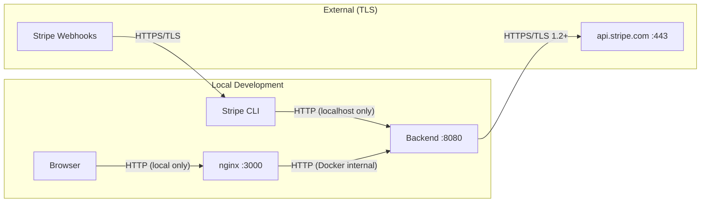

### Channel 1: Backend → Stripe API (TLS — Always Secure)

The Stripe Java SDK communicates with `https://api.stripe.com` over TLS 1.2+. This is always encrypted, in both local development and production.

**How certificate validation works:**

1. The SDK makes an HTTPS request to `api.stripe.com`
2. Stripe's server presents its TLS certificate, signed by a public Certificate Authority (DigiCert)
3. The Java runtime validates the certificate chain against its built-in trust store (`$JAVA_HOME/lib/security/cacerts`)
4. The `cacerts` file ships with the JDK and contains root CA certificates from all major CAs
5. If the chain is valid and the CA is trusted, the connection proceeds
6. If validation fails, Java throws `SSLHandshakeException` and the request is rejected

No configuration is needed — the JDK's trust store already trusts Stripe's CA. The `sk_test_` API key is transmitted in the `Authorization` header over this encrypted connection.

**Authentication layers:**
- TLS encrypts the transport (prevents eavesdropping)
- API key authenticates the caller (proves your backend is authorized)
- Both are always active on every Stripe SDK call

### Channel 2: Stripe → Webhook Endpoint

#### Local Development (Stripe CLI)

In local development, Stripe cannot reach `localhost` directly. The Stripe CLI solves this:

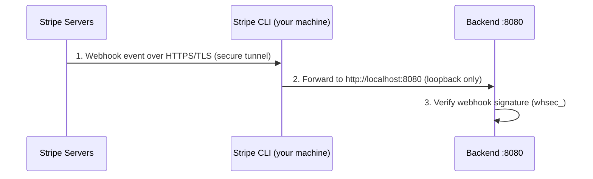

- Stripe → CLI: Secured by TLS. The CLI authenticates with Stripe using your account credentials from `stripe login`.
- CLI → Backend: HTTP on `localhost` (loopback interface). This traffic never leaves your machine, so TLS is not required.
- Webhook signature: The backend verifies every webhook payload using `Webhook.constructEvent(payload, sigHeader, webhookSecret)`. This HMAC-SHA256 signature proves the event came from Stripe and was not tampered with, providing message-level authentication independent of transport security.

#### Production (Direct HTTPS)

In production, Stripe sends webhooks directly to your server. Requirements:

| Requirement | Details |
|-------------|---------|
| HTTPS endpoint | Stripe requires `https://` URLs for webhook endpoints. HTTP is rejected. |
| Valid TLS certificate | Must be signed by a publicly trusted CA (e.g., Let's Encrypt, DigiCert). Self-signed certificates are **not accepted** by Stripe — their servers validate the certificate chain before delivering webhooks. |
| Webhook signature verification | Still required in production. The `whsec_` secret is obtained from the Stripe Dashboard (Developers > Webhooks > Signing secret), not from the CLI. |

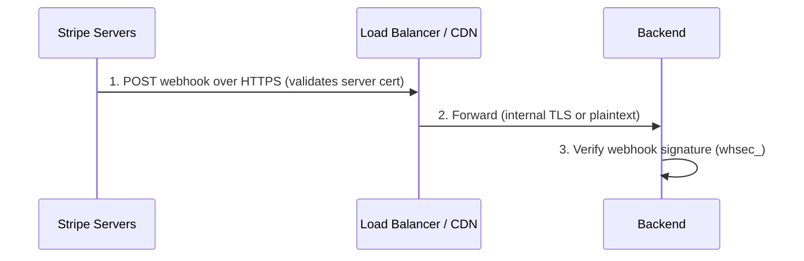

**Production TLS options:**
- **AWS ALB/CloudFront** — Terminates TLS with an ACM certificate (free, auto-renewed)
- **Let's Encrypt + Certbot** — Free CA-signed certificates, auto-renewed every 90 days
- **nginx with a CA-signed cert** — Place the cert on the nginx container directly

Self-signed certificates will not work for Stripe webhooks in production. Stripe's servers perform standard TLS certificate validation and will refuse to deliver events to endpoints with untrusted certificates.

### Channel 3: Browser → nginx (Frontend)

#### Local Development

Currently HTTP (`http://localhost:3000`). This is acceptable for local development because:
- Traffic stays on the loopback interface
- No sensitive data (card numbers) passes through this channel — card details are entered on Stripe's hosted checkout page, not in our frontend

#### Production

Must be HTTPS. Options:
- Terminate TLS at a load balancer (ALB, CloudFront) with a CA-signed certificate
- Or configure nginx with a TLS certificate directly

### Channel 4: nginx → Backend (Internal)

Currently HTTP (`http://backend:8080`) on the Docker internal network. This traffic is not exposed to the internet.

#### Production

For defense-in-depth, you can add TLS or mTLS on this internal channel:
- **TLS**: Backend presents a certificate, nginx verifies it
- **mTLS**: Both sides present certificates and verify each other — prevents unauthorized services from calling the backend

For most deployments, network-level isolation (VPC, security groups) is sufficient for internal traffic. mTLS is recommended for zero-trust environments.

### Security Summary

| Channel | Local Dev | Production |
|---------|-----------|------------|
| Backend → Stripe API | TLS 1.2+ (automatic via JDK trust store) | TLS 1.2+ (same) |
| Stripe → Webhook | Stripe CLI tunnel (TLS + localhost) | HTTPS with CA-signed cert (required by Stripe) |
| Webhook authenticity | HMAC-SHA256 signature (`whsec_`) | HMAC-SHA256 signature (`whsec_`) |
| Browser → Frontend | HTTP (localhost only) | HTTPS with CA-signed cert |
| nginx → Backend | HTTP (Docker internal network) | TLS or mTLS (recommended) |
| API key security | `sk_test_` in `.env` (git-ignored) | Environment variable / secrets manager |

---

## Webhook Troubleshooting

| Problem | Solution |
|---------|----------|
| Backend returns 400 on webhooks | Ensure `STRIPE_WEBHOOK_SECRET` in `.env` matches the `whsec_` from `stripe listen`, not from the Dashboard |
| No events arriving | Ensure `stripe listen` is running in a separate terminal |
| CLI says "not logged in" | Run `.\stripe-bin\stripe.exe login` again |
| Events forwarded but backend not responding | Verify the backend is running on port 8080 |

## Project Structure

```
StripeIntegration/
├── backend/                    # Spring Boot application
│   ├── src/main/java/com/payment/
│   │   ├── controller/         # REST endpoints
│   │   │   ├── CheckoutController.java          # One-time invoice checkout
│   │   │   ├── SubscriptionCheckoutController.java  # Subscription management
│   │   │   ├── InstallmentCheckoutController.java   # Installment plan (two-phase)
│   │   │   ├── WebhookController.java           # Stripe webhook receiver
│   │   │   └── GlobalExceptionHandler.java      # Error handling
│   │   ├── entity/             # JPA entities
│   │   └── repository/         # Spring Data JPA repositories
│   ├── src/main/resources/
│   │   └── application.yml     # Configuration (env vars)
│   ├── build.gradle
│   └── Dockerfile
├── frontend/                   # React + Vite + Tailwind CSS
│   ├── src/pages/
│   │   ├── ItemsPage.tsx              # Add invoice line items
│   │   ├── CheckoutPage.tsx           # Review invoice + GST + pay
│   │   ├── SuccessPage.tsx            # Payment confirmation
│   │   ├── SubscriptionsPage.tsx      # Subscribe / check status / cancel
│   │   ├── SubscriptionSuccessPage.tsx
│   │   ├── InstallmentsPage.tsx       # Merchant: create plans
│   │   ├── InstallmentPayPage.tsx     # Customer: pay first installment
│   │   └── InstallmentSuccessPage.tsx
│   ├── nginx.conf              # API proxy configuration
│   └── Dockerfile
├── docker-compose.yml          # Full stack orchestration
├── .env.example                # Environment variable template
└── README.md
```

## Relationship to AuctionSystem

This POC validates the following patterns for adoption in AuctionSystem:

| POC Pattern | AuctionSystem Use Case |
|-------------|----------------------|
| One-time invoice checkout | Auction winner pays for won items (items + tax → Stripe Checkout) |
| Recurring subscriptions | Premium membership tiers for auction participants |
| Installment plans (two-phase) | High-value item payment plans set up by the auction house |
| Webhook signature verification | Confirming payment completion before releasing items to winners |
| Stripe Checkout Sessions | Secure, PCI-compliant payment collection without handling card data |
